# ing-lab-4

## Trabajo Practico N1

### __1- Descargar Git y eleccion de IDE__

* Descargar e instalar Git
* Elegir IDE como cliente visual. En mi caso elegi Visual Studio Code.

### __2- Crear un repositorio local y agregar archivos__

* Creamos un repositorio local en un directorio de nuestra pc.

    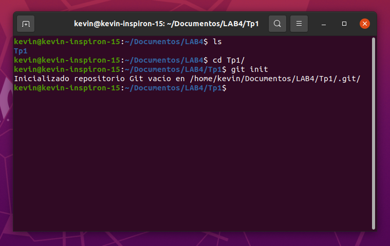

* Agregamos un archivo Readme.md, que contenga tu nombre y un link a nuestro CV.md. Este ultimo estara al mismo nivel de carpeta .
    * [Readme.md](https://github.com/KevinGenaro/TP1-SistemasDeControlDeVersiones)
    * [Mi Curriculum Vitae](https://github.com/KevinGenaro/TP1-SistemasDeControlDeVersiones/blob/master/CV.md)

    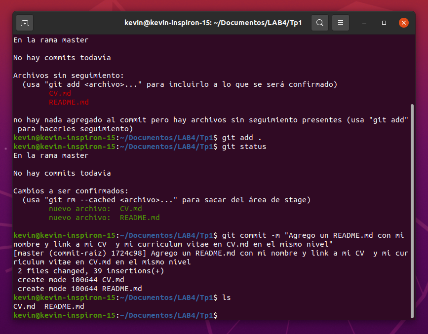

### __3- Crear un repositorio remoto__

* Creamos un nuevo repositorio en Github (vacío)

* Asociamos el repositorio local con el repositorio de Github.
* Subimos los cambios locales a Github.

    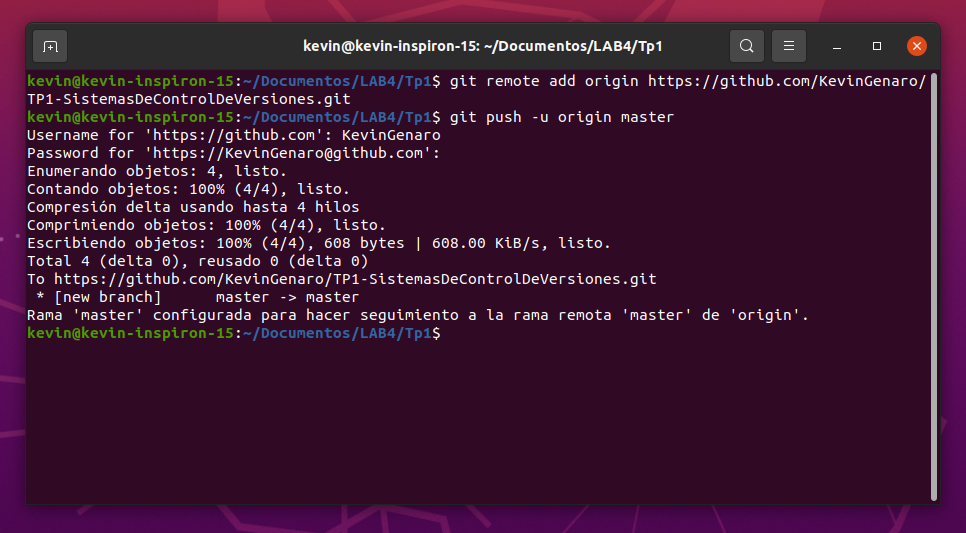

### __4- Familiarizarse con el concepto de Pull Request__

* Creamos un branch local y agregamos cambios a dicho branch
    

     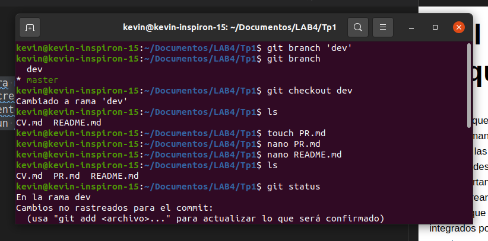

* [Pull Request](https://github.com/KevinGenaro/TP1-SistemasDeControlDeVersiones/blob/master/PR.md)

* Subimos el cambio a dicho branch y creamos un nuevo pull request.

    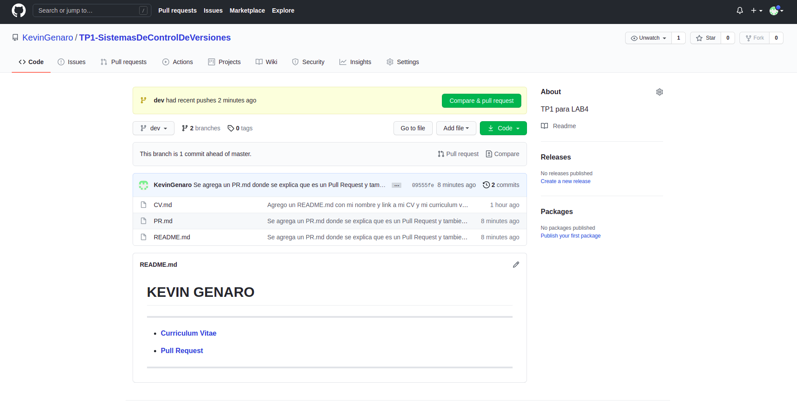

    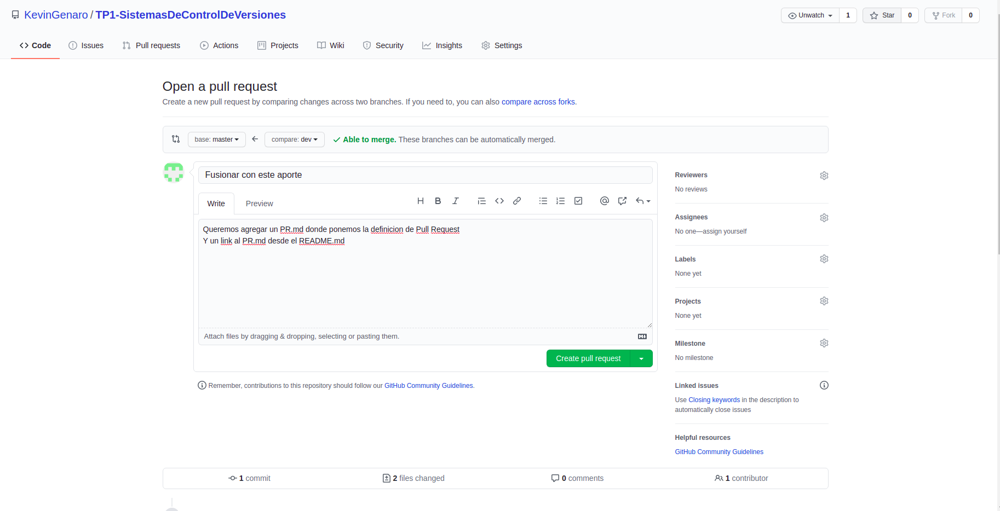

    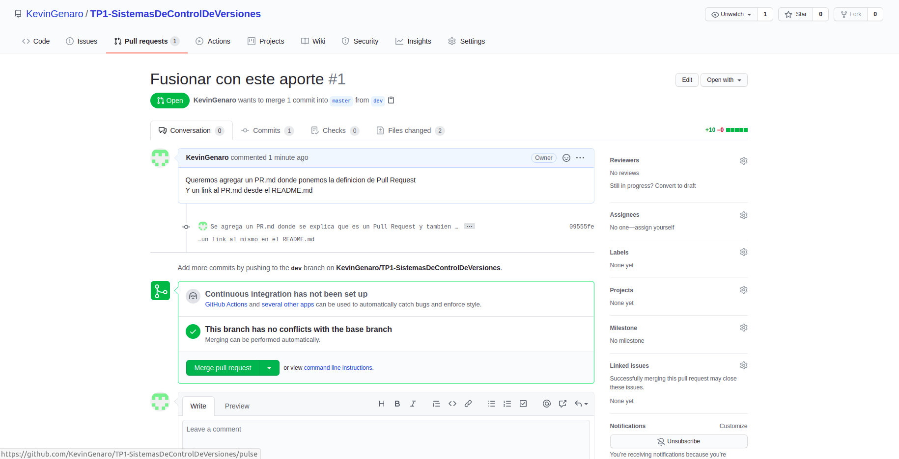

* Completamos el proceso de revisión en github y mergeamos el PR a la rama master.

    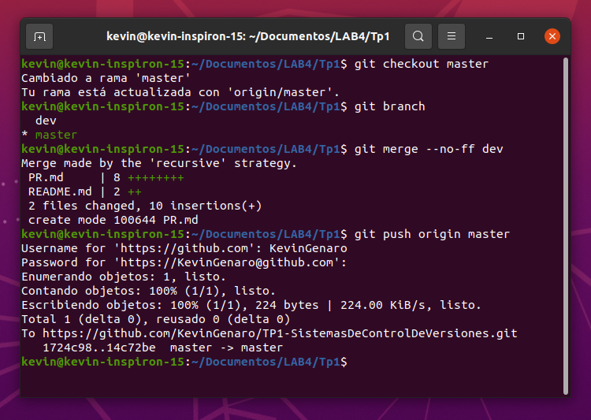

### __5- Mergear código con conflictos__

*   Clonamos en un segundo directorio de nuestro equipo el repositorio creado en Github.
*   En el clone inicial, modificamos el CV.md cambiando algunas lineas.
*   Hacemos commit y subimos el cambio a master en Github.
*   En el segundo clone también realizamos cambios en las mismas líneas que se modificaron en el otro directorio.
*   Intentamos subir el cambio, haciendo un commit y luego un push. Se genera un error que detallamos mas abajo.

    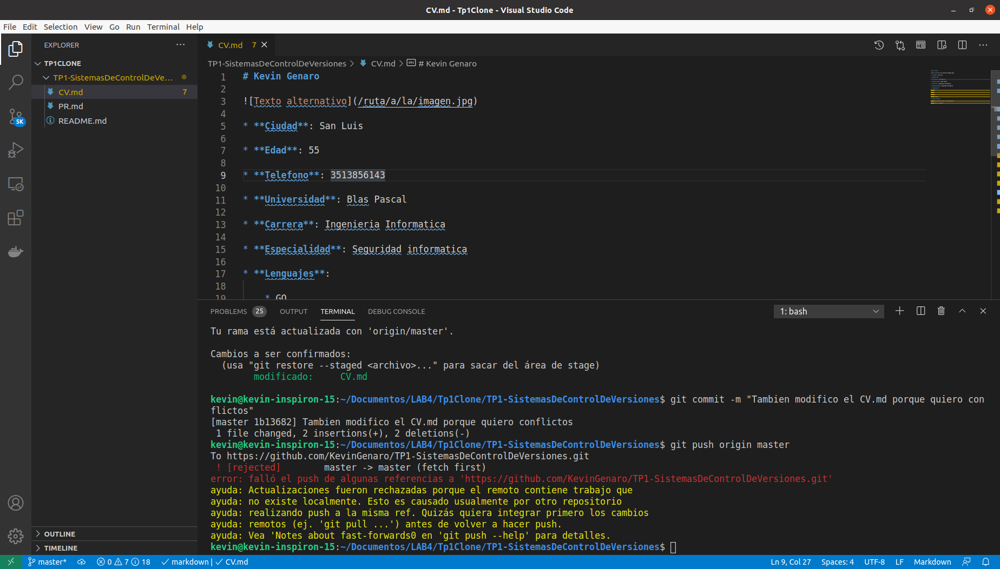

    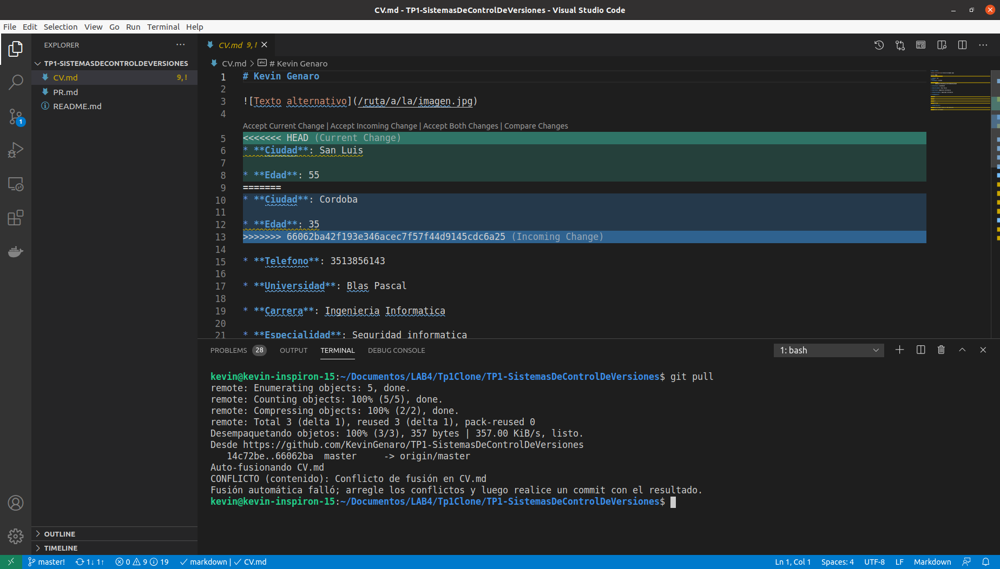

*   Resolvemos los conflictos del código eligiendo que change queremos sostener.
*   Explicamos las versiones LOCAL, BASE y REMOTE dentro de nuestro README.
    * [LOCAL, BASE, REMOTO](https://github.com/KevinGenaro/TP1-SistemasDeControlDeVersiones)      
*   Pusheamos el cambio mergeado.

     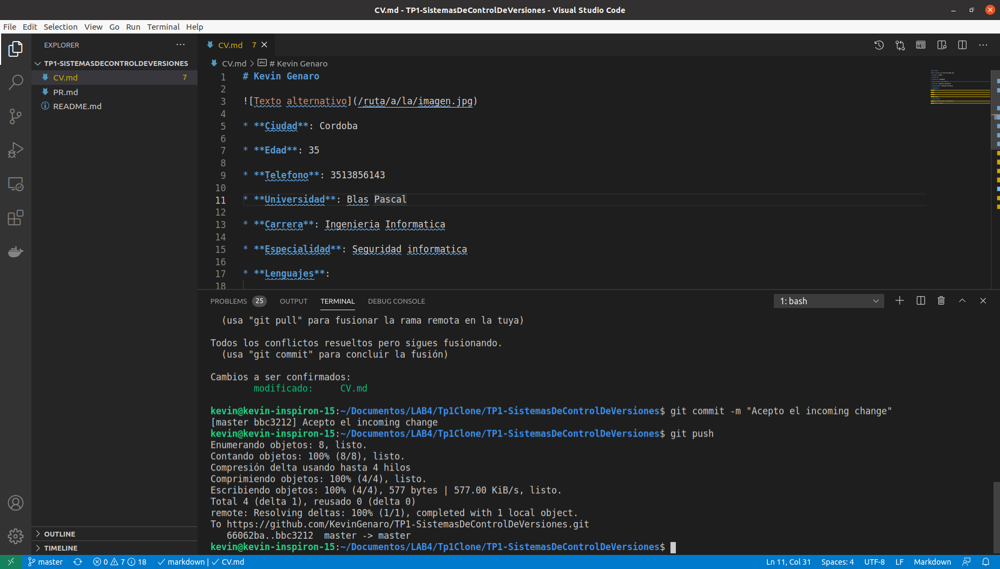

### __6- Algunos ejercicios online__

*   Para finalizar entramos a la página https://learngitbranching.js.org/
*   Completamos los ejercicios Introduction Sequence

    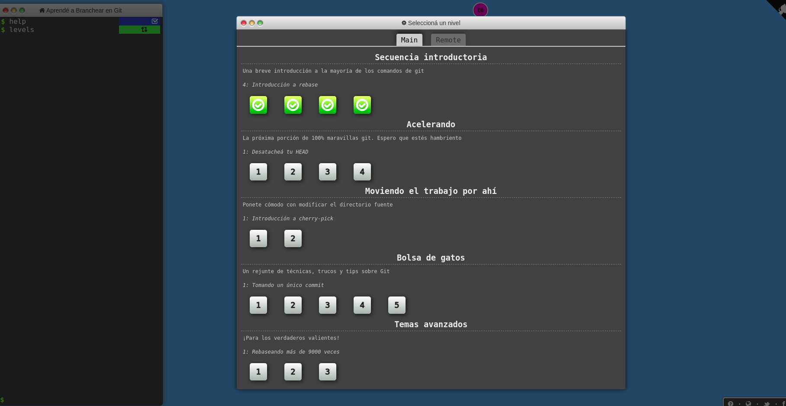

